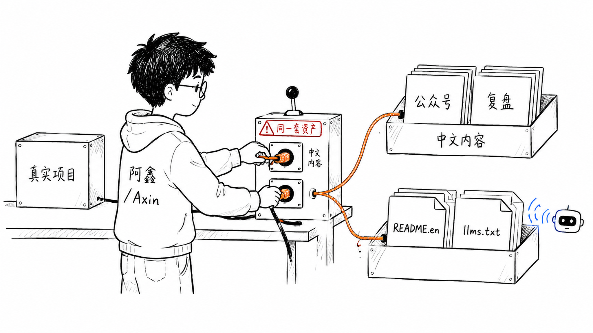
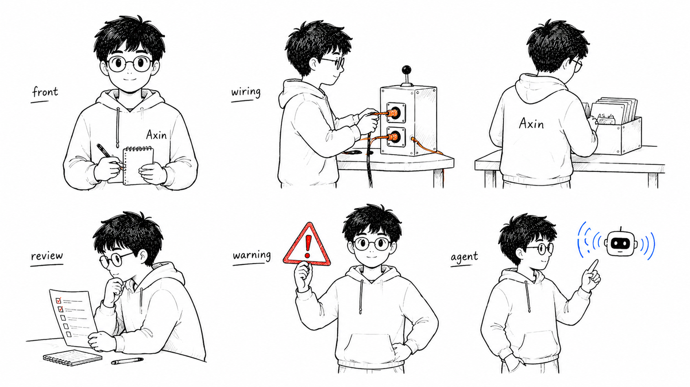
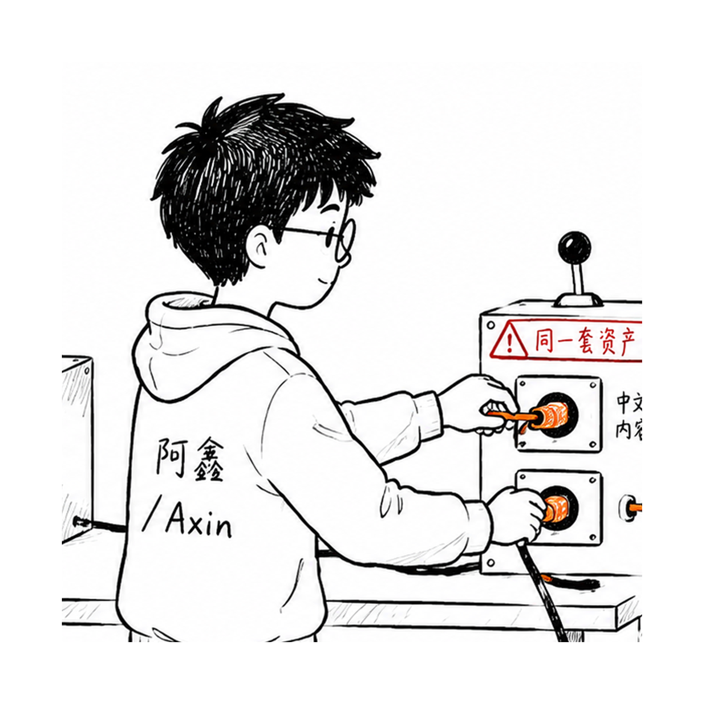
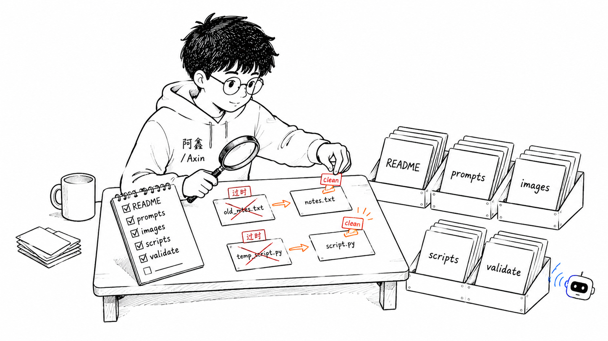
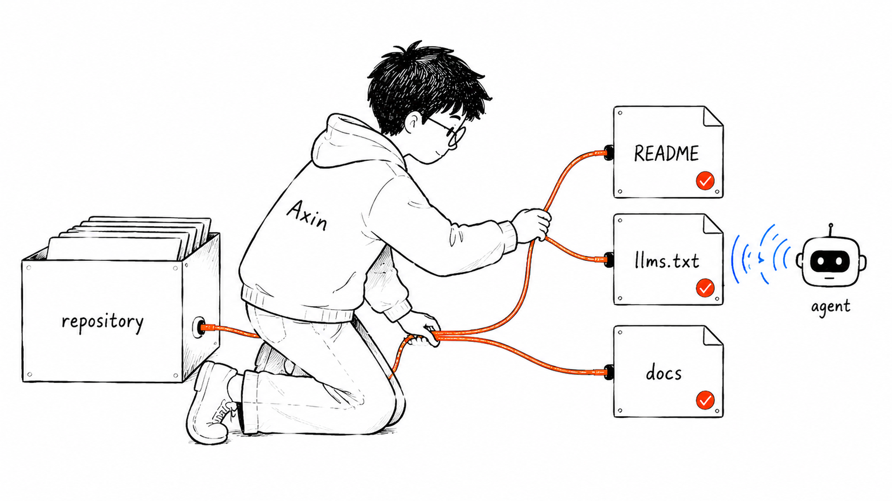
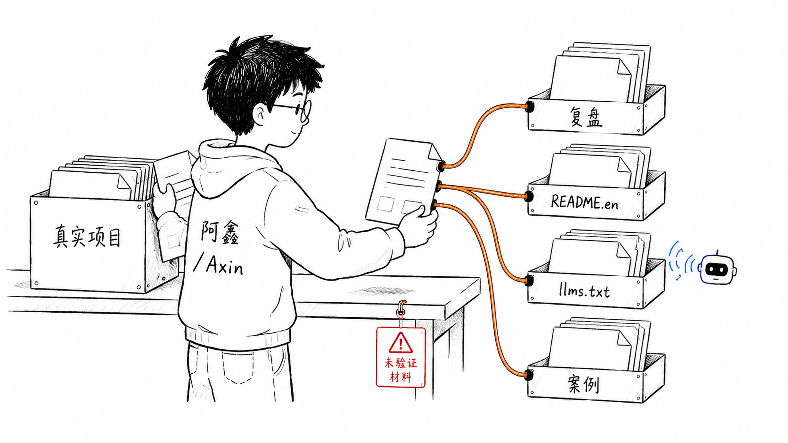

# 阿鑫个人 IP 配图流程

> 输入一篇文章，先诊断它是否值得资产化，再输出配图策略、图片提示词和双语分发计划。

[中文](README.md) · [English](README.en.md) · [快速上手](docs/QUICK_START.md) · [English Quick Start](docs/QUICK_START.en.md) · [五轮审查](docs/FIVE_PASS_AUDIT.md) · [LLM 入口](llms.txt) · [内容操作系统](docs/AXIN_CONTENT_OS.md) · [角色资产库](docs/CHARACTER_LIBRARY.md) · [案例库](cases/README.md)

这不是通用头像包，也不是 PPT 模板。它是一套面向开源开发者和内容创作者的 article-to-illustration workflow：先诊断一篇文章有没有清楚判断、证据、流程、读者和风险，再生成可复制到生图工具的 `image-prompts.md`。

默认视觉 IP 叫 **阿鑫**。阿鑫是一个黑发、眼镜、hoodie、安静但很能干的真人手绘内容操作员，不是吉祥物、抽象怪物或工具箱角色。你也可以传入自己的 IP 形象图，让自己的角色参与画面的核心动作。

## 3 分钟跑通

不需要先安装 skill。克隆仓库后，在仓库根目录执行：

```powershell
.\scripts\new-content-package.ps1 `
  -ArticlePath .\examples\sample-article.md `
  -Slug sample-article `
  -ImageCount 4 `
  -LanguageMode zh
```

然后打开：

```text
content-packages/sample-article/content-diagnosis.md
content-packages/sample-article/image-prompts.md
```

你会先看到内容诊断，再看到 4 条完整配图 prompt，以及对应的 `analysis.md`、`illustration-shot-list.md`、`distribution-plan.md` 和 `publish-checklist.md`。更完整的首次使用说明见 [docs/QUICK_START.md](docs/QUICK_START.md)。

## 先诊断，不生成 prompt

如果你只想判断一篇文章值不值得配图，可以先跑：

```powershell
.\scripts\analyze-article.ps1 -ArticlePath .\examples\sample-article.md
```

它会输出 `Score`、`Verdict`、`Gaps`、`Rewrite Actions` 和 `Recommended image count`。空泛文章会被判成 `not_ready`，避免把口号包装成视觉资产。

## 换成自己的文章和 IP

```powershell
.\scripts\new-content-package.ps1 `
  -ArticlePath .\path\to\your-article.md `
  -CharacterImagePath .\path\to\your-ip.png `
  -CharacterName "你的IP名" `
  -ImageCount 5 `
  -LanguageMode auto
```

脚本会把你的 IP 参考图复制到内容包的 `character-reference/`，并在每条图片 prompt 里要求角色保持身份一致、参与核心动作，而不是贴在画面角落当装饰。

查看帮助：

```powershell
.\scripts\new-content-package.ps1 -Help
```

如果 PowerShell 阻止脚本运行，见 [Quick Start 常见问题](docs/QUICK_START.md#powershell-不让我运行脚本怎么办)。

## 输出文件怎么看

- `content-diagnosis.md`：文章资产化诊断，包括分数、结论、缺口、改写动作和建议配图数量。
- `analysis.md`：文章标题、段落、语言判断和认知锚点。
- `illustration-shot-list.md`：每张图的主题、结构、角色动作和建议元素。
- `image-prompts.md`：适合复制到生图工具的完整 prompt。
- `image-prompts.jsonl`：适合接入 CLI 或批处理的结构化任务。
- `distribution-plan.md`：中文和英文渠道如何消费同一份项目经验。
- `publish-checklist.md`：发布前检查，避免把计划、mock 或占位写成完成。

## 阿鑫 IP 资产

### 阿鑫主视觉



### 阿鑫 IP 资产板



### 阿鑫角色锚点



## 工作流示例图







## 适合什么

- 给中文文章、项目复盘、公众号、知乎、GitHub README、Notion 文档生成正文配图。
- 把“经验 -> 判断 -> 资产 -> 发布”这种个人 IP 流程画成可记忆的视觉隐喻。
- 为一人公司、AI 工作流、内容复利、产品验证、公开构建等主题做统一风格插图。
- 给未来内容流水线提供稳定的角色、风格、prompt、QA 和保存规范。

不适合：

- 商业海报 KV。
- 复杂 PPT 信息图。
- 可爱吉祥物表情包。
- 大段文字型课程页。
- 严格可编辑矢量图。

## 安装成 agent skill

先用脚本跑通示例，再按需要安装：

```powershell
.\scripts\install-local-skill.ps1
```

同步插件快照：

```powershell
.\scripts\sync-platform-packages.ps1
```

完整平台入口见 [docs/MULTI_PLATFORM.md](docs/MULTI_PLATFORM.md)。首页不铺平台名矩阵，避免浏览器自动翻译把产品名改成奇怪的中文词。

## GEO / LLM 可发现

- `llms.txt`：给 LLM/agent 的短入口。
- `llms-full.txt`：给长上下文 agent 的完整项目摘要。
- `docs/index.html`：可用于 GitHub Pages 的文本落地页。
- `docs/GEO.md`：GEO 策略、关键词和后续发布建议。
- `README.en.md`：英文入口，便于 GitHub、LLM 和海外开发者理解。

## 目录结构

```text
.
├── README.md
├── README.en.md
├── LICENSE
├── NOTICE.md
├── AGENTS.md
├── CLAUDE.md
├── llms.txt
├── llms-full.txt
├── .claude-plugin/
├── .cursor/
├── .clinerules/
├── assets/
│   └── character-library/
├── cases/
├── content-packages/
├── docs/
│   ├── QUICK_START.md
│   ├── QUICK_START.en.md
│   ├── AXIN_CONTENT_OS.md
│   ├── CHARACTER_LIBRARY.md
│   ├── GEO.md
│   └── index.html
├── prompts/
├── axin-personal-ip-illustrations/
│   ├── SKILL.md
│   ├── agents/
│   │   └── openai.yaml
│   ├── assets/
│   │   └── examples/
│   └── references/
│       ├── axin-ip.md
│       ├── platform-adapters.md
│       ├── style-dna.md
│       ├── composition-patterns.md
│       ├── prompt-template.md
│       ├── qa-checklist.md
│       └── workflow.md
├── examples/
│   ├── sample-article.md
│   └── prompts.md
├── platforms/
└── scripts/
    ├── generate-axin-examples-cli.ps1
    ├── install-local-skill.ps1
    ├── install-hermes-skill.ps1
    ├── install-all-platforms.ps1
    ├── analyze-article.ps1
    ├── new-content-package.ps1
    ├── lib/
    │   └── ContentDiagnosis.ps1
    ├── sync-platform-packages.ps1
    ├── new-illustration-brief.ps1
    └── validate-repo.ps1
```

真正需要安装到本机 skill 目录的是子目录：

```text
axin-personal-ip-illustrations/
```

## 生成规范

- 图片默认 16:9 横版，角色锚点图可用 1:1。
- 纯白背景，不要纸纹、米色、阴影、渐变。
- 黑色手绘线稿为主，少量橙色表达路径，红色表达风险或结果，蓝色表达系统反馈。
- 一张图只讲一个判断、流程或状态。
- 中文标注最多 5-8 处，每处尽量 2-8 个字。
- 阿鑫或自定义 IP 必须参与核心动作。如果去掉角色，图仍然完全成立，说明这张图不合格。

## 验证

```powershell
.\scripts\validate-repo.ps1
```

验证会检查必需文件、示例图片、skill 元数据、平台快照、README 双语入口、快速上手文档、诊断脚本和示例文章是否存在。

## License

MIT License. See [LICENSE](LICENSE).
