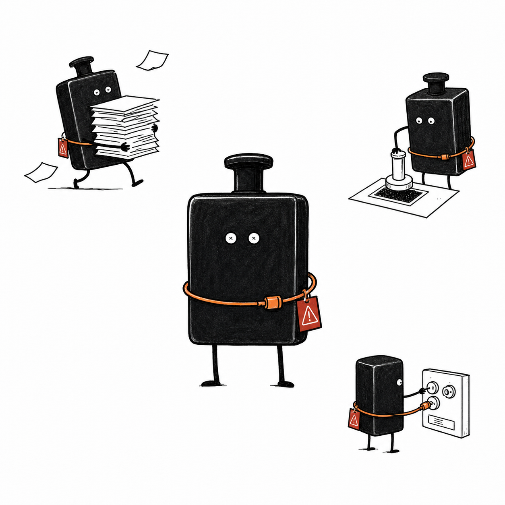
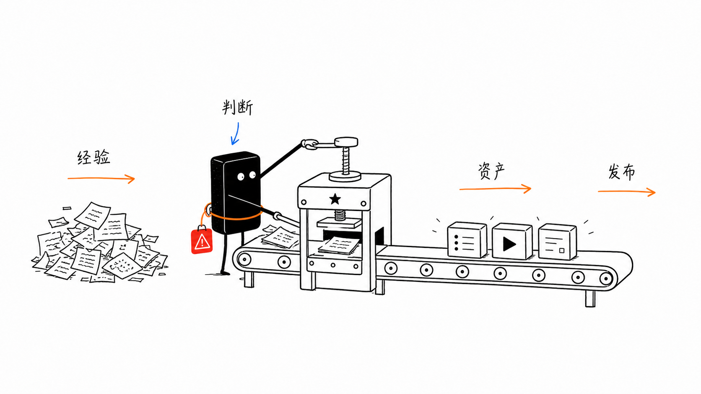

# 阿墨个人 IP 配图流程

> 把真实经验、判断、项目进展和内容方法论，变成一套可复用的个人 IP 手绘配图资产。

这不是通用头像包，也不是 PPT 模板。它是一套 Codex Skill：先理解你要表达的个人 IP 观点，再把其中一个判断、流程、状态或隐喻，转成一张 16:9 白底手绘正文配图。

默认视觉 IP 叫 **阿墨**：一个黑色印章工位形象，认真、冷静、有点荒诞，像在内容工厂里负责把经验压成资产的小操作员。

## 示例资产

### 阿墨角色锚点

角色锚点图用于固定 IP 外形，因此使用 1:1 画布。



### 个人 IP 内容工坊

正文配图样例使用默认 16:9 横版。



## 适合什么

- 给中文文章、项目复盘、公众号、知乎、GitHub README、Notion 文档生成正文配图。
- 把“经验 -> 判断 -> 资产 -> 发布”这种个人 IP 流程画成可记忆的视觉隐喻。
- 为一人公司、AI 工作流、内容复利、产品验证、公开构建等主题做统一风格插图。
- 给未来内容流水线提供稳定的角色、风格、prompt、QA 和保存规范。

不适合：

- 商业海报 KV。
- 复杂 PPT 信息图。
- 可爱吉祥物表情包。
- 大段文字型课程页。
- 严格可编辑矢量图。

## 快速使用

把 skill 复制到 Codex skills 目录：

```powershell
.\scripts\install-local-skill.ps1
```

安装后在 Codex 里使用：

```text
Use $amo-personal-ip-illustrations 为这篇中文文章设计并生成 4 张阿墨个人 IP 正文配图。
要求：16:9 横版、纯白背景、黑色手绘线稿、少量红橙蓝中文手写批注。

<粘贴文章>
```

只做配图策略，不生成图：

```text
Use $amo-personal-ip-illustrations 先不要生图。
请分析这篇文章哪里值得配图，输出 5 张左右的 shot list。
每张写清楚主题、核心意思、结构类型、阿墨在做什么、建议中文标注。
```

## 工作流

1. 读文章、项目复盘、脚本、README 或用户给的主题。
2. 提炼个人 IP 的认知锚点：判断、断点、流程、前后对比、常见坑、资产沉淀。
3. 先输出 shot list，每张图只讲一个核心意思。
4. 为每张图选择结构类型：内容工坊、证据质检、发布路径、复利飞轮、角色状态、方法分层、小漫画分镜。
5. 让阿墨承担核心动作：压印、过筛、接线、称重、贴警示、装箱、出货、回收。
6. 使用 `imagegen` 逐张生成 bitmap 图片。
7. 按 QA 清单检查白底、留白、角色参与、少字、非 PPT、非可爱化。
8. 保存到 `assets/<topic-slug>-illustrations/` 或 skill 的 `assets/examples/`。

## 目录结构

```text
.
├── README.md
├── LICENSE
├── NOTICE.md
├── amo-personal-ip-illustrations/
│   ├── SKILL.md
│   ├── agents/
│   │   └── openai.yaml
│   ├── assets/
│   │   └── examples/
│   └── references/
│       ├── amo-ip.md
│       ├── style-dna.md
│       ├── composition-patterns.md
│       ├── prompt-template.md
│       ├── qa-checklist.md
│       └── workflow.md
├── examples/
│   └── prompts.md
└── scripts/
    ├── install-local-skill.ps1
    ├── new-illustration-brief.ps1
    └── validate-repo.ps1
```

真正需要安装到 Codex 的是子目录：

```text
amo-personal-ip-illustrations/
```

## 生成规范

- 图片默认 16:9 横版。
- 纯白背景，不要纸纹、米色、阴影、渐变。
- 黑色手绘线稿为主，少量橙色表达路径，红色表达风险或结果，蓝色表达系统反馈。
- 一张图只讲一个判断、流程或状态。
- 中文标注最多 5-8 处，每处尽量 2-8 个字。
- 阿墨必须参与核心动作。如果去掉阿墨，图仍然完全成立，说明这张图不合格。

## 验证

```powershell
.\scripts\validate-repo.ps1
```

验证会检查必需文件、示例图片、skill 元数据和本地安装脚本是否存在。

## License

MIT License. See [LICENSE](LICENSE).
